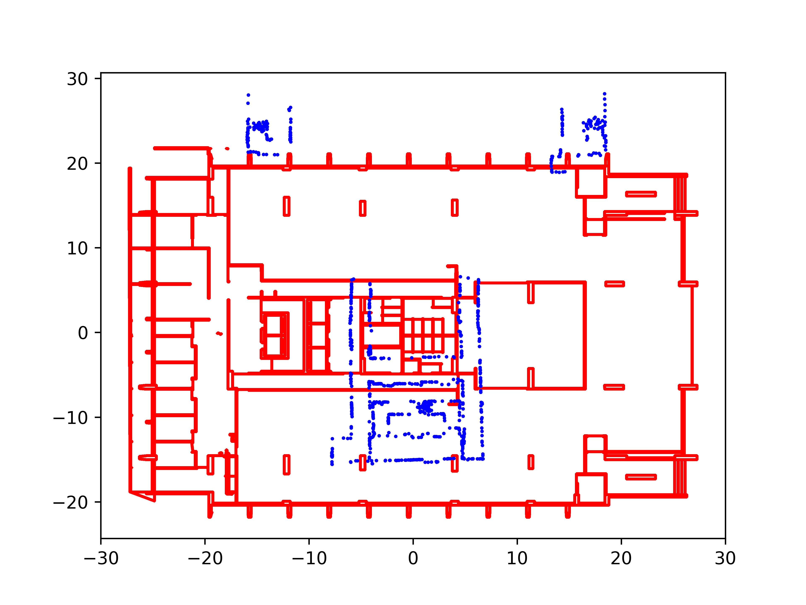
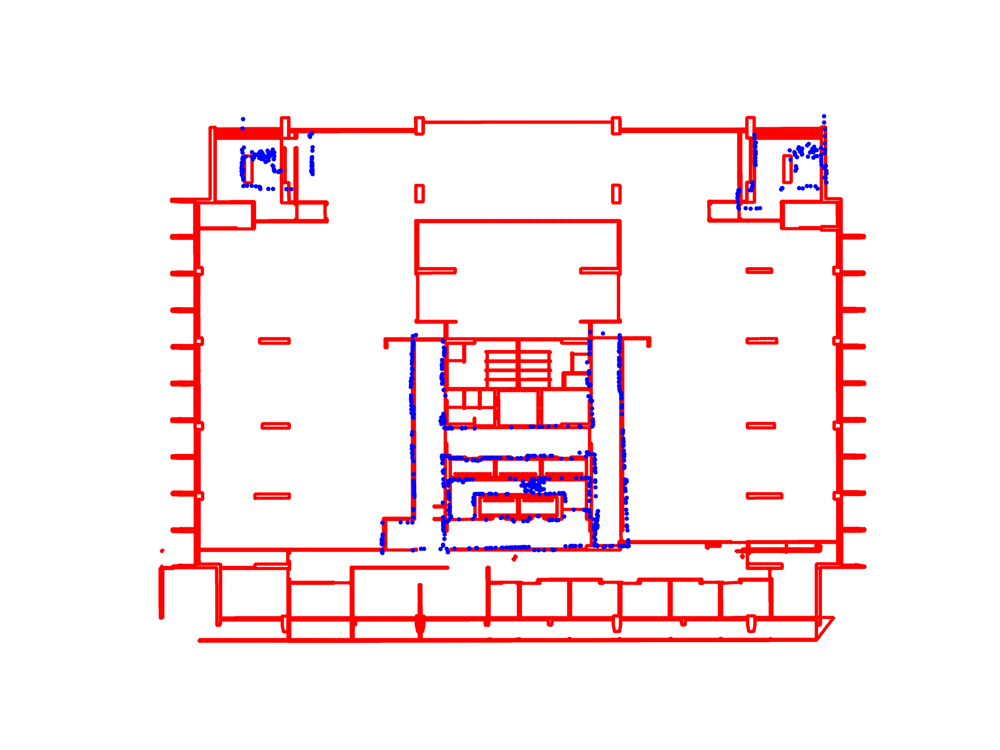

# About RegARD

The **Reg**istration based on **A**rchitectural **R**eflection **D**etection (RegARD) is a free and fast library for building layout registration from point sets, i.e., points sampled from point clouds or floor plans.

# How to cite

[Wu, Y.](wuyijie@hku.hk), [Shang J.](jgshang@cug.edu.cn), [Lu W.](wilsonlu@hku.hk), and [Xue F.*](xuef@hku.hk). Toward digital twin buildings: Architectural symmetry-based coarse registration of smartphone’s 3D point clouds with 2D floor plans. (under review)

# How does it work

First, RegARD detects the innate architectural reflection symmetries based on [ODAS](//github.com/ffxue/odas) for the globally optimal **rotation** constants and proposes an initial alignment based on the symmetry axes. 
Then, RegARD applies advanced derivative-free optimization (DFO) algorithms to optimize the other degrees of freedom (5-DoF), i.e., translation and scaling. 

# Why RegARD is fast for building layout registration
The 5-DoF registration for building layouts is challenging due to the omnipresent self-similarities inside buildings. RegARD separates the 5-DoF problem into two subproblems: i.e., one for determining the possible rotations and the other for optimizing the translation and scaling. This indicating we only optimize 4 DoF based on highly accurate rotation, which significantly improves the registration efficiency. 

# Dependencies

Codes have only been tested on Ubuntu 18.04 and 20.04. The following guidelines are mainly for Ubuntu. 
Welcome any other contributions or experiments on the other platform :)

- [nlopt](//nlopt.readthedocs.io/) 
```sh
conda install -c conda-forge nlopt
```
- [libcmaes](//github.com/beniz/libcmaes)
```sh
conda install -c conda-forge libcmaes
```
- [open3d](//pypi.org/project/open3d/)
```sh
pip install open3d
```
- [numpy](//pypi.org/project/numpy/)
```sh
pip install numpy
```
- Python version: 3.8

# Registration

Note that the two point sets for registration are sampled from the CAD drawing and the 2D projected point cloud respectively. So, the code and args named the data as 'fp' and 'pc' or 'as-designed' and 'as-built'.

- Detect the architectural reflection axis
```sh
python3 ard.py --fp <fp-pcd> --pc <pc-pcd>
```
Pass the pcd files of the two point sets. Then the command will return the rho and theta of the symmetry axes. Copy them and pass to the reg.py as follows.

- Registration
```sh
python3 reg.py --fp <fp-pcd> --pc <pc-pcd> --reg_fig <reg-fig> -fp_rho <fp_rho> --fp_theta <fp_theta> --pc_rho <pc_rho> --pc_theta <pc_theta>
```
Pass the pcd files of the two point sets, the path of registration figure, and the results of architectural symmetry detection. Then the command will output the graphic result of the registration in the <reg-fig>
- Graphic example




# License

LGPL-3.0

# Acknowledgements

This work was supported by the Research Grant Council (RGC) of Hong Kong SAR (Nos. 17200218, 27200520).
